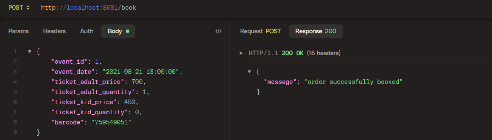
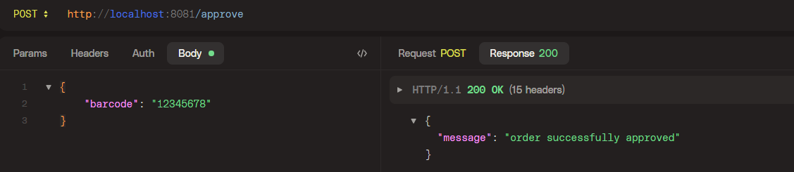
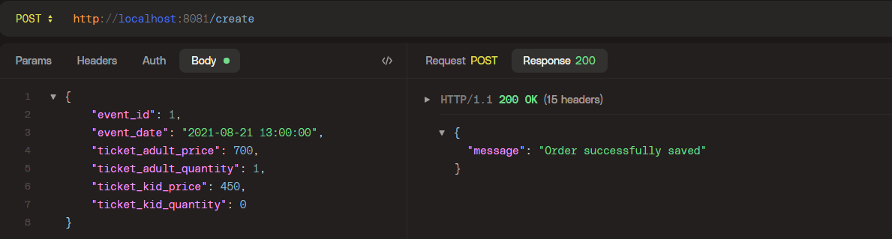
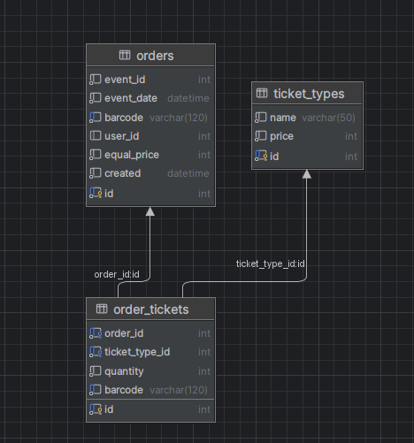

# Тестовое задание (используется Docker)

## Задание 1
## Запуск проекта

1. Запустите проект с помощью команды:

docker-compose up -d --build

2. Зайдите в контейнер PHP для установки зависимостей:

docker exec -it symfony-app-nginx-php-cli bash

3. Установите зависимости:

composer install

4. Выполните миграцию базы данных для 1го задания:

php bin/console doctrine:migrations:execute --up 'DoctrineMigrations\Version20241114210310'

5. Была создана подобие API (OrderController.php)

http://localhost:8081/book

http://localhost:8081/approve

6. Оформление билета (CreateOrderController.php)
   
http://localhost:8081/create

7. Сами обращения к апи и сохранения происходят в OrderService.php

## Задание 2

### Шаги нормализации:

- В качестве решения было принято решение по созданию дополнительных 
таблиц для возможности дальнейшего расширения системы. Так как у нас есть отдельная таблица с типами билетов, 
мы можем добавлять сколько угодно новых видов билетов.
- Так же была создана таблица-связка для возможности хранения множества билетов(баркодов) при 1ом заказе.

- Можно произвести миграцию:

php bin/console doctrine:migrations:execute --up 'DoctrineMigrations\Version20241115020759'

### Таблицы и их назначение:

#### Таблица ticket_types:

- Название: ticket_types
- Описание: Хранит информацию о различных типах билетов.
- Поля:
  - id: Уникальный идентификатор типа билета (INT, AUTO_INCREMENT, NOT NULL, PRIMARY KEY).
  - name: Название типа билета (VARCHAR(50), NOT NULL).
  - price: Цена билета (INT, NOT NULL).

#### Таблица orders:

- Название: orders
- Описание: Хранит информацию о заказах.
- Поля:
  - id: Уникальный идентификатор заказа (INT, AUTO_INCREMENT, NOT NULL, PRIMARY KEY).
  - event_id: Идентификатор события (INT, NOT NULL).
  - event_date: Дата и время события (DATETIME, NOT NULL).
  - barcode: Уникальный баркод заказа (VARCHAR(120), NOT NULL, UNIQUE).
  - user_id: Идентификатор пользователя (INT, DEFAULT NULL).
  - equal_price: Общая цена заказа (INT, NOT NULL).
  - created: Дата и время создания заказа (DATETIME, NOT NULL).

#### Таблица order_tickets:

- Название: order_tickets
- Описание: Связующая таблица между заказами и типами билетов.
- Поля:
  - id: Уникальный идентификатор записи (INT, AUTO_INCREMENT, NOT NULL, PRIMARY KEY).
  - order_id: Идентификатор заказа (INT, NOT NULL).
  - ticket_type_id: Идентификатор типа билета (INT, NOT NULL).
  - quantity: Количество билетов данного типа в заказе (INT, NOT NULL).
  - barcode: Уникальный баркод для каждого билета (VARCHAR(120), NOT NULL, UNIQUE).
  - Связи с таблицей orders и ticket_types через order_id и ticket_type_id.
